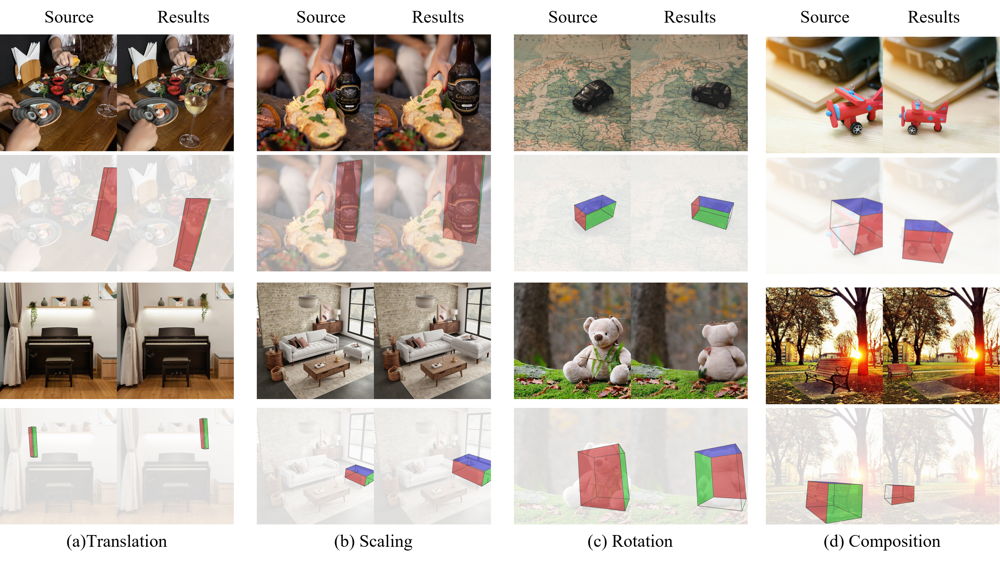

# BoxCtrl: 3D-Aware Visual Prompting for Geometric Image Editing (SIGGRAPH 2026).
[](https://arxiv.org/abs/2606.23270)
[](https://beaglew.github.io/BoxCtrl-site/)



Feifei Wang $^{1}$, Shiyuan Yang $^{1}$, Xiaoyu Li $^{2}$, Jing Liao $^{1}$

<font size="1"> $^1$ City University of Hong Kong, Hong Kong SAR
<font size="1"> $^2$ Tencent </font>

## Overview
BoxCtrl enables precise image translation, scaling, and rotation through RGB 3D bounding boxes as visual prompts. By encoding 3D geometry into intuitive color-coded boxes, BoxCtrl provides fine-grained control over object position, size, and orientation beyond text-based editing. A two-stage SFT-RL training strategy further improves geometric accuracy and real-world editing quality.


## ⚙️ Setup

```bash
git clone https://github.com/beaglew/BoxCtrl.git
cd BoxCtrl

export PYTHONNOUSERSITE=1
conda create -n boxctrl python=3.10
conda activate boxctrl

# 1) Install PyTorch for your CUDA — https://pytorch.org/get-started/previous-versions/
# CUDA 12.4
pip install torch==2.6.0 torchvision==0.21.0 torchaudio==2.6.0 --index-url https://download.pytorch.org/whl/cu124

# 2) Install other required packages
pip install -r requirements.txt
```

## 📥 Download Models

**Base Model** — [black-forest-labs/FLUX.1-Kontext-dev](https://huggingface.co/black-forest-labs/FLUX.1-Kontext-dev)

```bash
huggingface-cli login
huggingface-cli download black-forest-labs/FLUX.1-Kontext-dev --local-dir ./models/FLUX.1-Kontext-dev
```

**BoxCtrl LoRA** — [wakalaka/BoxCtrl](https://huggingface.co/wakalaka/BoxCtrl)

```bash
huggingface-cli download wakalaka/BoxCtrl --local-dir ./checkpoints/lora
```

## 🎯 Inference

Each sample in `assets/metadata.json` needs: `image_id`, `prompt`, `image`, `src_box`, `tgt_box`.

```bash
python infer.py \
  --base_path ./models/FLUX.1-Kontext-dev \
  --lora_path ./checkpoints/lora \
  --input_dir ./assets \
  --output_dir ./outputs \
  --json_path ./assets/metadata.json \
  --device 0 \
  --dtype bf16
```

## 📚 Citation

```bibtex
@inproceedings{10.1145/3799902.3811169,
author = {Wang, Feifei and Yang, Shiyuan and Li, Xiaoyu and Liao, Jing},
title = {BoxCtrl: 3D-Aware Visual Prompting for Geometric Image Editing},
year = {2026},
isbn = {9798400725548},
publisher = {Association for Computing Machinery},
address = {New York, NY, USA},
url = {https://doi.org/10.1145/3799902.3811169},
doi = {10.1145/3799902.3811169},
booktitle = {Proceedings of the Special Interest Group on Computer Graphics and Interactive Techniques Conference Conference Papers},
articleno = {164},
numpages = {11},
keywords = {controllable image generation, image editing},
location = {
},
series = {SIGGRAPH Conference Papers '26}
}
```

## 📄 License

This project is licensed under the Apache License 2.0 — see the [LICENSE](LICENSE) file for details.

[FLUX.1-Kontext-dev](https://huggingface.co/black-forest-labs/FLUX.1-Kontext-dev) and [BoxCtrl LoRA](https://huggingface.co/wakalaka/BoxCtrl) weights are not included in this repo. Download them from Hugging Face and follow the [FLUX.1 [dev] Non-Commercial License](https://github.com/black-forest-labs/flux/blob/main/model_licenses/LICENSE-FLUX1-dev).

## 🙏 Acknowledgments

We thank the following open-source projects and research works that made BoxCtrl possible:

- **[FLUX.1-Kontext-dev](https://huggingface.co/black-forest-labs/FLUX.1-Kontext-dev)** by [Black Forest Labs](https://blackforestlabs.ai/) — our base image editing model
- **[Orient Anything V2](https://orient-anythingv2.github.io/)** ([SpatialVision/Orient-Anything-V2](https://github.com/SpatialVision/Orient-Anything-V2)) — unified 3D orientation and rotation understanding
- **[DiffusionNFT](https://github.com/NVlabs/DiffusionNFT)** — online diffusion reinforcement learning via forward-process optimization
- **[Flow-GRPO](https://github.com/yifan123/flow_grpo)** — online RL training framework for flow matching models
- **[Edit-R1](https://github.com/PKU-YuanGroup/Edit-R1)** — reinforcement learning framework for instruction-based image editing
- **[HuggingFace](https://huggingface.co/)** for the [diffusers](https://github.com/huggingface/diffusers) library
